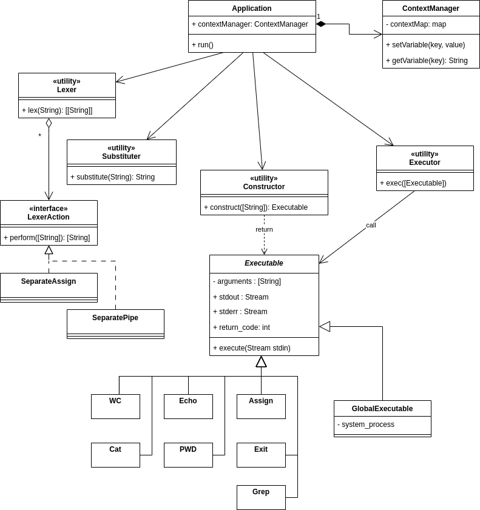

# Практика 4: CLI

# Описание архитектуры

[UML class diagram](https://viewer.diagrams.net/?tags=%7B%7D&target=blank&highlight=0000ff&edit=_blank&layers=1&nav=1&title=cli-class_scheme.drawio#Uhttps%3A%2F%2Fraw.githubusercontent.com%2Fkgamora%2Fcli-itmo-sd-2023%2Fupdate_architecture%2Farchitecture%2Fcli-class_scheme.drawio)

#### Точкой входа в программу является метод `run` класса `Application`.

### Application

У объекта данного класса есть поле `contextManager`, метод `run`.

В `contextManager` сохраняются переменные окружения, добавленные пользователем во время сеанса использования программы.
В методе `run` поспедовательно выполняются следующие действия:

1. Чтение входных данных до символа переноса строки.

2. Разбиение строки на лексемы с помощью `Lexer`. Разбиение входной строки на список лексем в соответствие с синтаксисом bash;  в том числе разбиение по лексемам `|` (pipeline), `=`, находящимся вне строковых литералов, с сохранением этих лексем в списке.

4. Подстановка переменных из контекста приложения в каждую из полученных строк с помощью `Substituter`.

5. Разделение списка лексем по лексемам `|` (pipeline) на список списков. 

6. Создание экземпляров класса `Executable` с помощью `Constructor` для каждого из полученных списка лексем. 

7. Последовательное исполнение экземпляров `Executable` с помощью `Executor`. При этом происходит передача вывода предыдущих экземпляров `Executable` на ввод последующим. 

8. В случае успешного завершения всех `Executable` производится вывод пользователю результата последнего экземпляра `Executable`. В случае возникновения ошибки во время исполнения одного из `Executable` выполнение прекращается и выводится информации об ошибке.

`NB` В случае выполнения команды `exit` работа приложения завершается.

## Обработка ввода

В данном разделе будет описана специфика работы классов и методов, отвечающих за обработку ввода.

### Substitution (+ Context variables) `(Фаза 2)`

### Lexer

Данный класс содержит метод `lex`, принимающий строку и разбивающий ее на массивы лексем следующим образом.

1. Строка разделяется по пробельным символам.
2. Если в строке есть символ `=` или `|`, то строка разделяется по этому символу, сам символ `=` или `|` тоже выделяется в отдельную лексему. 
3. Если в строке встречаются кавычки, то разделения в подстроке, ограниченной кавычками не происходит.
4. Если отсутствует закрывающая кавычка для любой из открывающей кавычки, то пользователю сообщается ошибка о нарушении синтаксиса, обработка пользовательского ввода прекращается. 

### Substituter

Класс `ContextManager` отвечает за хранение пользовательских переменных. 
Пользовательской переменной называется символическое имя, состоящие из букв, цифр и знака `_`, которой соответствует некоторая строка. 

Класс `Substituter` имеет метод `substitute`, принимающий строку и выполняющий подстановку следующим образом:

1. Если строка ограничена одинарными кавычками, строка возвращаяется без кавычек.
2. Если строка ограничена двойными кавычками, то кавычки удаляются.
3. Выполняется замена всех вхождений в строке, удовлетворяющий регулярному выражению `"(\$\b\w*)"` на переменную из контекста, имеющую название совпадающее с `\b\w*`. 
4. Если переменная с таким названием отсутствует в контексте, то выполняется замена на пустую строку.

### Constructor

Данный класс имеет метод `construct`, принимающий список лексем и конструирующий из него объекты класса `Executable`.

1. Если вторая лексема **соответствует** символу `=`, то создается соответствующий наследник класса `Executable` отвечающий за добавление или изменение пользовательских переменных. Остальные лексемы передаются в качестве аргументов.
1. Если первая лексема **соответствует** названию встроенной команды, то создается соответствующий наследник класса `Executable`. Остальные лексемы передаются в качестве аргументов.
2. Если первая лексема **не** **соответствует** названию встроенной команды, то создается наследник класса `Executable`, позволяющий сделать системный вызов этой команды. Остальные лексемы передаются в качестве аргументов.

## Исполнение команд

### Executor

Данный класс имеет метод `exec`, принимающий список объектов класса `Executable` и последовательно выполняющий их, передавая выходный поток очередного объекта класса `Executable` следующему объекту в входной поток.  В случае возникновения ошибки во время исполнения одного из `Executable` выполнение последующих не производится и пользователю выводится информации об ошибке. Если ошибок не произошло, то вывод последнего `Executable` передается пользователю.

### Executable

Объекты данного класса имеет метод `execute`, принимающий стандартный поток ввода и выполняющий соответствующую команду. Также они содержат следующие поля:

> `arguments: [String]` - содержит список аргументов команды

> `stdout: Stream` - поток вывода команды

> `stderr: Stream` - поток ошибок команды

> `return_code: int` - код возврата команды

#### Встроенные команды

В данном разделе описаны представители класса `Executable`, реализованные в приложении.

`cat [FILE]`  — вывести в поток вывода содержимое файла.

`echo [FILE]` — вывести на экран свой аргумент (или аргументы).

`wc [FILE]` — вывести количество строк, слов и байт в файле.

`pwd` — вывести текущую директорию.

`=` - инфиксная команда, которая добавляет в контекст пользовательскую переменную с именем предыдущей лексемы и значением последующей. 

`grep` - выполнить поиск паттернов в файлах. Требуется поддержка:
  - регулярных выражений в запросе;
  - ключа `-w` — поиск только слова целиком;
  - формально `grep -w` ищет подстроки, ограниченные `non-word constituent character`, а именно не буквы, цифры или символ подчёркивания; однако что такое буквы — лучше спросить у вашей стандартной библиотеки, потому что бывает `Unicode` и его классы символов, ваша реализация может отличаться от настоящего поведения `grep`;
  - ключа `-i` — регистронезависимый (`case-insensitive`) поиск;
  - ключа `-A` — следующее за `-A` число говорит, сколько строк после совпадения надо распечатать, например, `-A 0` печатает только строку, на которой найдено совпадение, а `-A 10` — ещё и `10` строк ниже;

`exit` — выйти из интерпретатора.

#### Внешние команды

Класс `GlobalExecutable` отвечает за вызов команд, которые не предусмотрены в данном приложении.
